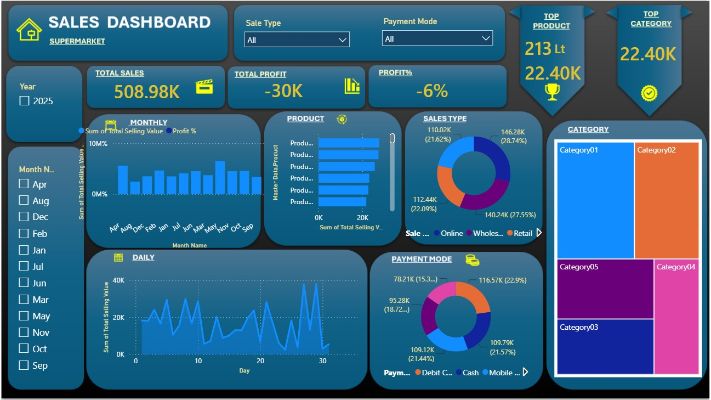

# 📊 Supermarket Sales Analytics Dashboard

An interactive and dynamic **Microsoft Power BI Dashboard** designed to analyze supermarket retail performance, track profitability, and uncover deep insights into customer buying behaviors. 

This project demonstrates end-to-end data processing, data modeling, and data visualization using retail transactional data.

---

## 📈 Key Insights & Features Tracked

* **Overall Performance:** Quick view of high-level business metrics including **Total Sales ($508.98K)**, Total Profit, and Profit Margins.
* **Sales Channels & Payments:** Deep-dive analysis of sales distribution across different channels (**Online, Retail, and Wholesale**) and customer payment preferences (**Cash, Debit/Credit Cards, and Mobile Wallets**).
* **Product & Category Performance:** Interactive **Treemaps** and charts to identify top-performing product categories and track individual product sales.
* **Time-Series Trend Analysis:** Visualizations tracking daily and monthly sales patterns to recognize seasonal trends and peak sales periods.

---

## 🛠️ Tools & Technologies Used

* **Microsoft Power BI Desktop:** Used for Data Import, Data Modeling, DAX calculations, and Dashboard Visualization.
* **Microsoft Excel:** Source dataset containing transactional and master product data.
* **Data Visualization Techniques:** Line charts, Column charts, Donut charts, Treemaps, Advanced KPI Cards, and Interactive Slicers for dynamic filtering.

---

## 📸 Dashboard Preview

---

## 📂 Project Structure

* `power BI dashboard.pbix` - The main Power BI project file.
* `Book1.xlsx` - Source dataset containing:
    * `Input Data` (Transactional sales records)
    * `Master Data` (Product & price reference details)
* `README.md` - Documentation of the project.

---

## 🚀 How to View the Project

1. Download and install [Power BI Desktop](https://powerbi.microsoft.com/desktop/).
2. Clone or download this repository.
3. Open the `power BI dashboard.pbix` file to explore the interactive dashboard.
